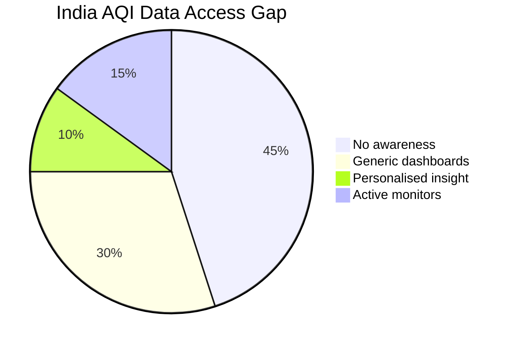
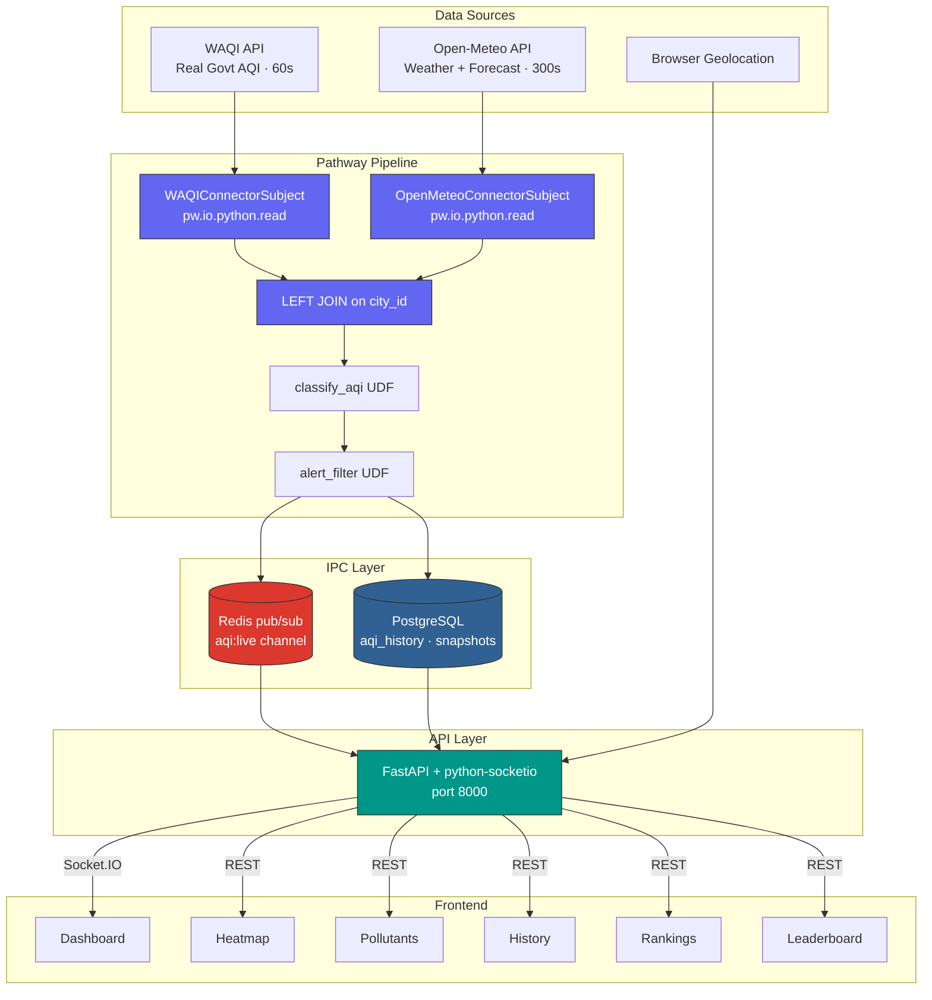
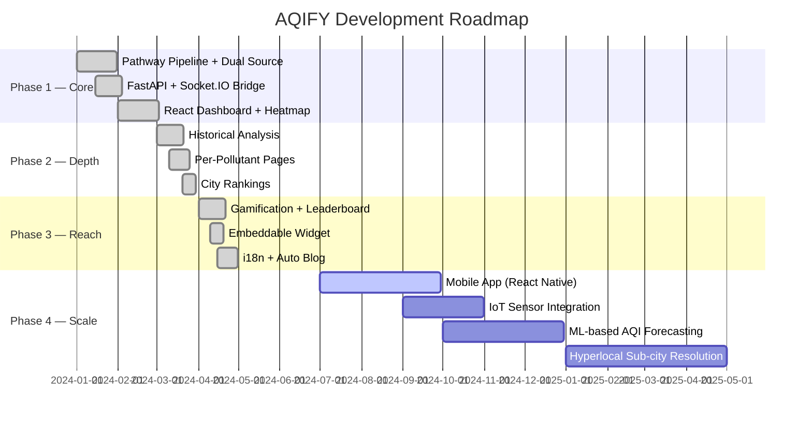

<div align="center">


<h3>🌫️ Real-Time AQI Intelligence Engine — Powered by Pathway</h3>
<h4><i>Live air quality data. Personalised health insights. Gamified engagement.</i></h4>

[](https://pathway.com)
[](https://reactjs.org/)
[](https://fastapi.tiangolo.com/)
[](https://www.postgresql.org/)
[](https://redis.io/)
[](https://www.docker.com/)

<h4>
  <a href="#-quick-start">Quick Start</a>
  <span> · </span>
  <a href="#-features">Features</a>
  <span> · </span>
  <a href="#-architecture">Architecture</a>
  <span> · </span>
  <a href="#-tech-stack">Tech Stack</a>
  <span> · </span>
  <a href="#-gamification">Gamification</a>
</h4>

<br/>


</div>

---

## 🎯 The Problem We're Solving

<table>
<tr>
<td width="60%">

### 🌍 Air Quality — A Silent Crisis

Millions of Indians make daily decisions — when to exercise, whether to open windows, should children go to school — with zero understanding of the air they're breathing. Existing solutions fail them:

- 📊 **Raw numbers, no context** — AQI 147 means nothing without health guidance
- 👤 **Zero personalisation** — same advice for a 7-year-old asthmatic and a healthy adult athlete
- ⏳ **Stale data** — batch-refreshed dashboards showing yesterday's air quality today
- 🏙️ **City-level only** — no drill-down to your neighbourhood station
- 📉 **No historical depth** — can't compare today's air to the same day last year
- 😴 **No engagement** — people check once, forget, never build healthy habits

> **AQIFY's answer**: A real-time, personalised, gamified AQI intelligence platform built on Pathway's stream processing engine — delivering live air quality insights that are actually actionable.

</td>
<td width="40%">



### 📉 The Reality

- **91%** of Indians breathe unsafe air (WHO)
- **60%** unaware of real-time AQI tools
- **<5%** receive personalised health guidance
- **0** platforms combine real-time + history + gamification

</td>
</tr>
</table>

---

## 💡 Our Solution: AQIFY

<div align="center">

### **Real-Time AQI Intelligence, Personalised for Every Breath**

*Live Stream Processing · Multi-Pollutant Tracking · Historical Analysis · City Rankings · Gamified Health Engagement · Embeddable Widgets · Auto-Generated SEO Blog*

#### **10 Powerful Features. 1 Unified Platform. Powered by Pathway.**


</div>

---

## ✨ Core Features

<table>
<tr>
<td width="33%" valign="top">

### 🏠 Live AQI Dashboard


- 🔴 Live AQI gauge with colour-coded health categories
- 🏥 Personalised health advisory card
- 📍 Per-station breakdown within your city
- 🌤️ Current weather: temp, humidity, wind, UV
- 📈 24-hour AQI forecast chart
- 📅 Year-over-year same-day insight

**Tech:**
<p>


</p>

</td>
<td width="33%" valign="top">

### 🗺️ India AQI Heatmap


- 🟢🟡🔴 Colour-coded city markers (Good → Hazardous)
- 🖱️ Click any city to drill down
- 📍 Sub-city station resolution
- 🔍 AQI scale legend overlay
- 🔄 Auto-refresh with live data

**Tech:**
<p>


</p>

</td>
<td width="33%" valign="top">

### 🔬 Per-Pollutant Pages


- 📊 Dedicated pages for PM2.5, PM10, NO₂, O₃, CO, SO₂
- 📉 Last 120 readings chart with WHO/EPA threshold lines
- 📈 Average, maximum, minimum stats
- 🔄 Switch pollutant with one click
- 📐 Safe limit annotations on charts

**Tech:**
<p>


</p>

</td>
</tr>

<tr>
<td width="33%" valign="top">

### 📅 Historical AQI Analysis


- 📆 Year-over-year monthly comparison (2023–2026)
- 🌅 24-hour AQI pattern over last 30 days
- 🏆 Best hour / Worst hour statistics
- ☀️ Day average vs 🌙 Night average
- 📊 Hourly bar chart with colour coding

**Tech:**
<p>


</p>

</td>
<td width="33%" valign="top">

### 🏙️ City Rankings


- 🔥 Hottest / 🧊 Coldest / 💨 Most Polluted / ✅ Cleanest
- 📊 AQI + humidity + wind + temperature per city
- 🔄 Updated every 5 minutes
- 📍 45+ Indian cities tracked
- 🎯 One-click city drill-down

**Tech:**
<p>


</p>

</td>
<td width="33%" valign="top">

### 🏆 Gamified Leaderboard


- ⭐ Points for daily check-ins & health actions
- 🏅 Badges for streaks and milestones
- 🌍 Global + city-level leaderboards
- 📈 Personal health score trend
- 🎯 Daily challenges

**Tech:**
<p>


</p>

</td>
</tr>

<tr>
<td width="33%" valign="top">

### 🧩 Embeddable AQI Widget


- 📋 One-line `<script>` embed code
- 🏙️ City-configurable, auto-updating
- 🎨 Matches host site theme
- 📱 Responsive for any screen size
- 🔗 Links back to full AQIFY dashboard

**Tech:**
<p>


</p>

</td>
<td width="33%" valign="top">

### 🌐 Multi-Language Support (i18n)


- 🔤 Auto-detects browser locale
- 🇮🇳 Hindi, Tamil, Telugu, Bengali + more
- 🔄 Runtime language switching
- 🏷️ All health advisory text translated
- ✅ AQI scale labels localised

**Tech:**
<p>


</p>

</td>
<td width="33%" valign="top">

### 📝 Auto-Generated SEO Blog


- 🤖 Weekly auto-generated city AQI reports
- 🔍 SEO-optimised meta tags per page
- 📰 Markdown-rendered blog posts
- 📅 APScheduler cron every Monday 6AM
- 🌍 City-specific content at scale

**Tech:**
<p>


</p>

</td>
</tr>
</table>

---

## 🖥️ App Screenshots

<div align="center">

| Screen | What You See |
|--------|-------------|
| 🏠 **Dashboard** | Live AQI 52 (Moderate) for Indore — health advisory, station breakdown, weather widget, 24h forecast, YoY insight, pollutant bars |
| 🗺️ **Heatmap** | 45+ Indian cities colour-coded by AQI in real time — green to red, click to drill down |
| 📊 **History** | Year-over-year monthly comparison 2023–2026, 24h daily pattern, best/worst hour analysis |
| 🔬 **Pollutants** | PM2.5 history chart for last 120 readings — 53.7 avg, 78.0 max, 25.0 min with EPA threshold lines |
| 🏙️ **Rankings** | 45 cities ranked by Hottest / Coldest / Most Polluted / Cleanest with live AQI + weather data |

</div>

---

## 🏗️ System Architecture

<div align="center">

### **Pathway-Powered Real-Time Pipeline**

</div>

```
┌──────────────────────────────────────────────────────────────────────────┐
│                           DATA SOURCES                                    │
│   [WAQI API]               [Open-Meteo API]       [User Geolocation]     │
│   Real govt station AQI    Weather + AQI Forecast  Browser GPS           │
│   US 0–500 scale           Free · No API key       Community reports     │
└──────┬─────────────────────────────┬───────────────────────────────────  ┘
       │ poll every 60s               │ poll every 300s
       ▼                              ▼
┌──────────────────────────────────────────────────────────────────────────┐
│              PATHWAY AQI PIPELINE  (pathway_aqi_pipeline.py)              │
│                                                                            │
│   WAQIStationConnectorSubject    OpenMeteoConnectorSubject                 │
│   pw.io.python.read()            pw.io.python.read()                      │
│          │                               │                                 │
│          ▼                               ▼                                 │
│   station_table ──── LEFT JOIN ──── weather_table   (joined on city_id)   │
│          │                                                                 │
│          ▼                                                                 │
│      combined_table                                                        │
│       ├── classify_aqi()    → health_category column                       │
│       └── alert_filter()    → rows where aqi > threshold                  │
│          │                                                                 │
│          ├──► Redis pub/sub  (aqi:live)                                    │
│          └──► pw.io.postgres.write_snapshot  → aqi_history table          │
└──────────────────────────────────────────────────────────────────────────┘
       ▼
┌──────────────────────────────────────────────────────────────────────────┐
│              FASTAPI SERVER  (api/main.py · port 8000)                    │
│   REST endpoints + Socket.IO server                                        │
│   Subscribes Redis "aqi:live" → broadcasts to browser clients             │
└──────────────────────────────────────────────────────────────────────────┘
       │
       ▼
┌──────────────────────────────────────────────────────────────────────────┐
│              FRONTEND  (React 18 + Vite · port 3000)                     │
│   Dashboard · Heatmap · Pollutants · History · Rankings · Leaderboard    │
└──────────────────────────────────────────────────────────────────────────┘
```



### Key Architectural Decisions

| Decision | Reason |
|----------|---------|
| `pw.io.python.ConnectorSubject` for ingestion | `pw.io.http.read` is a webhook listener, NOT an HTTP client. `ConnectorSubject` is the correct Pathway pattern for polling external REST APIs |
| Redis pub/sub (direct from Pathway) | Pathway publishes to `aqi:live`; FastAPI subscribes and relays to Socket.IO — zero file-based bridging |
| Celery removed entirely | Pathway's `ConnectorSubject` handles all background polling in a persistent loop. Celery would conflict |
| WAQI as primary AQI source | Returns real US AQI 0–500 from government stations. OpenWeatherMap only returns a 1–5 ordinal index |
| Open-Meteo for weather + forecast | Completely free, no API key, 5-day AQI forecast via CAMS European model |
| `@pw.udf` throughout pipeline | Replaces deprecated `pw.apply()` — verified against official Pathway 0.27.0 API |

---

## 🛠️ Tech Stack

<div align="center">

### **Production-Grade · Stream-Native · Containerised**

</div>

### Backend

<table>
<tr>
<td width="50%">

#### Stream Processing
<p>

</p>

- `pw.io.python.ConnectorSubject` — polls WAQI + Open-Meteo
- `@pw.udf` decorator — classify AQI, compute health categories
- `pw.io.postgres.write_snapshot` — persistent history writes
- `pw.Table.join` — real-time dual-source stream merging

#### API Server
<p>


</p>

</td>
<td width="50%">

#### Data & IPC
<p>


</p>

- Redis pub/sub: `aqi:live` channel (Pathway → FastAPI)
- PostgreSQL: `station_aqi_history`, `aqi_snapshot`, `city_registry`
- asyncpg + SQLAlchemy 2.0 for async queries
- Alembic for migrations

#### Scheduling
<p>

</p>

- Monday 6AM cron → auto-generates weekly city blog posts

</td>
</tr>
</table>

### Frontend

<table>
<tr>
<td width="50%">

#### Core Framework
<p>


</p>

#### State & Auth
<p>


</p>

#### Real-Time
<p>

</p>

</td>
<td width="50%">

#### Maps & Charts
<p>


</p>

#### Internationalisation & SEO
<p>


</p>

#### Styling
<p>


</p>

</td>
</tr>
</table>

### External APIs

| API | Purpose | Cost | Refresh |
|-----|---------|------|---------|
| 🌫️ **WAQI** | Real US AQI 0–500 from government stations | Free tier | 60 seconds |
| 🌤️ **Open-Meteo** | Weather + 5-day AQI forecast (CAMS) | **Completely free · No key** | 300 seconds |
| 📍 **IPinfo** | Visitor IP → city geolocation | Free tier | On request |
| 🔐 **Supabase** | Auth + gamification data | Free tier | Real-time |

### Docker Containers

| Container | Base Image | Size | Purpose |
|-----------|-----------|------|---------|
| `pathway_aqi` | python:3.11-slim | ~215 MB | Pathway stream pipeline |
| `api` | python:3.11-slim | ~165 MB | FastAPI + Socket.IO + Blog |
| `frontend` | nginx:alpine | ~21 MB | React SPA |
| `postgres` | postgres:15-alpine | ~240 MB | Persistent storage |
| `redis` | redis:7-alpine | ~35 MB | IPC pub/sub |
| **Total** | | **~676 MB** | All 5 containers |

---

## 📊 AQI Scale Reference

<div align="center">

| Category | AQI Range | Health Implication | Colour |
|----------|-----------|-------------------|--------|
| 🟢 **Good** | 0–50 | Air quality satisfactory, minimal risk | `#00E400` |
| 🟡 **Moderate** | 51–100 | Acceptable; some pollutants may concern sensitive groups | `#FFFF00` |
| 🟠 **USG** | 101–150 | Unhealthy for Sensitive Groups | `#FF7E00` |
| 🔴 **Unhealthy** | 151–200 | Everyone may begin to experience health effects | `#FF0000` |
| 🟣 **Very Unhealthy** | 201–300 | Health alert — serious effects for everyone | `#8F3F97` |
| 🟤 **Hazardous** | 300+ | Emergency conditions; entire population affected | `#7E0023` |

</div>

---

## 🏆 Gamification System

<div align="center">

### **Keep Users Breathing Mindfully — Every Day**


</div>

<table>
<tr>
<td width="50%">

#### ⭐ Points System

| Action | Points |
|--------|--------|
| Daily dashboard check-in | +10 |
| Check AQI during Unhealthy day | +20 |
| 7-day streak maintained | +50 bonus |
| Share AQI alert with community | +15 |
| Complete health challenge | +30 |
| First check of the month | +25 |

</td>
<td width="50%">

#### 🏅 Badge Categories

| Badge | Unlock Condition |
|-------|-----------------|
| 🌱 **Air Aware** | First check-in |
| 🔥 **Week Warrior** | 7-day streak |
| 🌍 **City Guardian** | Top 10 local leaderboard |
| 🌬️ **Breath Expert** | 30-day streak |
| 🏆 **AQI Champion** | #1 on city leaderboard |
| 📊 **Data Nerd** | Viewed history 10+ times |

</td>
</tr>
</table>

---

## 📂 Project Structure

```
aqify/
├── 📁 backend/
│   ├── 📁 pipeline/
│   │   ├── pathway_aqi_pipeline.py       # Main Pathway stream pipeline
│   │   ├── connectors/
│   │   │   ├── waqi_connector.py         # WAQIStationConnectorSubject
│   │   │   └── open_meteo_connector.py   # OpenMeteoConnectorSubject
│   │   ├── udfs/
│   │   │   ├── classify_aqi.py           # @pw.udf AQI classification
│   │   │   └── alert_filter.py           # @pw.udf threshold filtering
│   │   └── requirements_pipeline.txt
│   │
│   ├── 📁 api/
│   │   ├── main.py                       # FastAPI + Socket.IO server
│   │   ├── 📁 routes/
│   │   │   ├── aqi.py                    # Live AQI endpoints
│   │   │   ├── history.py                # Historical analysis
│   │   │   ├── rankings.py               # City rankings
│   │   │   ├── pollutants.py             # Per-pollutant pages
│   │   │   ├── blog.py                   # Auto-generated blog
│   │   │   └── gamification.py           # Points + badges
│   │   ├── 📁 bridges/
│   │   │   └── redis_bridge.py           # Redis → Socket.IO relay
│   │   └── requirements_api.txt
│   │
│   └── 📁 data/
│       ├── city_registry.py              # 45+ city slug + lat/lon registry
│       ├── city_seed.sql
│       ├── station_seed.sql
│       └── seed_historical.py            # Backfill 3 years of history
│
├── 📁 frontend/
│   ├── 📁 src/
│   │   ├── 📁 pages/
│   │   │   ├── Dashboard.tsx             # Live AQI dashboard
│   │   │   ├── Heatmap.tsx               # India AQI map
│   │   │   ├── Pollutants.tsx            # Per-pollutant charts
│   │   │   ├── History.tsx               # Historical analysis
│   │   │   ├── Rankings.tsx              # City rankings
│   │   │   ├── Leaderboard.tsx           # Gamification board
│   │   │   └── Blog.tsx                  # Auto-generated posts
│   │   ├── 📁 components/
│   │   │   ├── AQIGauge.tsx
│   │   │   ├── HealthAdvisory.tsx
│   │   │   ├── StationCard.tsx
│   │   │   ├── WeatherWidget.tsx
│   │   │   ├── YoYInsight.tsx            # Same-day YoY text
│   │   │   ├── ForecastChart.tsx
│   │   │   └── EmbedWidget.tsx           # Embeddable snippet
│   │   ├── 📁 i18n/
│   │   │   ├── en.json
│   │   │   ├── hi.json
│   │   │   └── ta.json
│   │   ├── 📁 store/
│   │   │   └── useAQIStore.ts            # Zustand global state
│   │   └── 📁 hooks/
│   │       ├── useSocket.ts              # Socket.IO live data
│   │       └── useAQIHistory.ts
│   └── package.json
│
├── docker-compose.yml
├── .env.example
└── README.md
```

---

## 🚀 Quick Start

### Prerequisites

<p align="center">


</p>

### API Keys Needed

| Service | Required | Get It |
|---------|----------|--------|
| WAQI Token | ✅ Yes | [aqicn.org/data-platform/token](https://aqicn.org/data-platform/token/) |
| IPinfo Token | ✅ Yes | [ipinfo.io/account/token](https://ipinfo.io/account/token) |
| Supabase URL + Key | ✅ Yes | [supabase.com](https://supabase.com) |
| Open-Meteo | ❌ None needed | Free, no registration |

### Installation

```bash
# 1️⃣ Clone the repository
git clone https://github.com/yourusername/aqify.git
cd aqify

# 2️⃣ Configure environment
cp .env.example .env
# Fill in: WAQI_TOKEN, IPINFO_TOKEN, SUPABASE_URL, SUPABASE_KEY
# DATABASE_URL, REDIS_URL are pre-configured for docker-compose

# 3️⃣ Seed the database
psql $DATABASE_URL < backend/data/city_seed.sql
psql $DATABASE_URL < backend/data/station_seed.sql

# 4️⃣ (Optional but recommended) Backfill 3 years of history
python backend/data/seed_historical.py  # ~10 minutes

# 5️⃣ Launch all 5 containers
docker-compose up --build
```

### Verify Everything is Running

```bash
# Check Pathway pipeline is writing data
docker exec aqify_pathway_aqi cat /tmp/aqi_output.jsonl | head -5

# Check Redis is receiving AQI updates
docker exec aqify_redis redis-cli subscribe aqi:live

# Check FastAPI is live
curl http://localhost:8000/health

# Check frontend
open http://localhost:3000
```

### Available Scripts

| Command | Description |
|---------|-------------|
| `docker-compose up --build` | 🚀 Launch all services |
| `docker-compose up pathway_aqi` | ⚡ Run pipeline only |
| `docker-compose logs -f api` | 📋 Stream API logs |
| `POST /blog/generate/weekly` | 📝 Trigger blog generation |
| `python backend/data/seed_historical.py` | 📊 Backfill historical data |

---

## 🌐 API Reference

<details>
<summary><b>⚡ Live AQI Endpoints</b></summary>

```typescript
GET /api/aqi/city/{city_id}
// Live AQI for a city (joined AQI + weather)

GET /api/aqi/stations/{city_id}
// All monitoring stations within a city

GET /api/aqi/heatmap
// All 45+ cities with current AQI for map markers

// Socket.IO event (real-time)
socket.on('aqi_update', (data: AQIUpdate) => { ... })
socket.on('station_update', (data: StationUpdate) => { ... })
```
</details>

<details>
<summary><b>📅 Historical Analysis Endpoints</b></summary>

```typescript
GET /api/history/{city_id}/yoy?month=2&years=2023,2024,2025,2026
// Year-over-year monthly comparison data

GET /api/history/{city_id}/24h-pattern?days=30
// 24-hour AQI pattern averaged over last N days

GET /api/history/{city_id}/same-day-insight
// "Today ranks Xth worst for this calendar day across 3 years"
```
</details>

<details>
<summary><b>🔬 Pollutant Endpoints</b></summary>

```typescript
GET /api/pollutants/{city_id}/{pollutant}
// pollutant: pm25 | pm10 | no2 | o3 | co | so2

Response: {
  readings: [{ timestamp, value, unit }],  // last 120
  average: number,
  maximum: number,
  minimum: number,
  safe_limit: number,   // WHO/EPA threshold
  unit: string
}
```
</details>

<details>
<summary><b>🏙️ Rankings Endpoint</b></summary>

```typescript
GET /api/rankings?sort=hottest|coldest|most_polluted|cleanest
// Returns 45+ cities sorted by chosen metric

Response: {
  cities: [{
    rank: number,
    city: string,
    country: string,
    aqi: number,
    temperature: number,
    humidity: number,
    wind_speed: number
  }],
  updated_at: string
}
```
</details>

<details>
<summary><b>🧩 Embeddable Widget</b></summary>

```html
<!-- Embed AQI widget for any city -->
<script
  src="https://aqify.app/widget.js"
  data-city="indore"
  data-theme="light"
  data-lang="en"
></script>
```
</details>

---

## 🧪 Pathway Implementation Notes

> For developers building on or extending AQIFY — key Pathway API gotchas and verified patterns.

### ✅ Verified API Patterns (v0.27.0)

| Pattern | Wrong ❌ | Correct ✅ |
|---------|----------|-----------|
| Polling external APIs | `pw.io.http.read(url)` | `pw.io.python.ConnectorSubject` |
| PostgreSQL write | `pw.io.postgres.write(..., output_table_type="snapshot")` | `pw.io.postgres.write_snapshot(table, settings, name, ["col"])` |
| UDF definition | `pw.apply(fn, pw.this.col)` | `@pw.udf def fn(...) -> type:` then `fn(pw.this.col)` |
| Primary key in write | `primary_key=[table.city_id]` | `primary_key=["city_id"]` (list of strings) |
| History table schema | Missing `time` + `diff` columns | Must include `time INTEGER NOT NULL` + `diff SMALLINT NOT NULL` |
| Postgres connection | `connection_string=os.environ[...]` | `postgres_settings = {host, port, dbname, user, password}` dict |

---

## 📈 Performance

<div align="center">

| Metric | Value |
|--------|-------|
| ⚡ AQI refresh rate | 60 seconds (WAQI) |
| 🌤️ Weather refresh rate | 300 seconds (Open-Meteo) |
| 🏙️ Cities monitored | 45+ Indian cities |
| 📡 Stations tracked | Sub-city resolution per city |
| 📦 Total Docker size | ~676 MB (5 containers) |
| 🖥️ Frontend bundle | ~584 KB gzipped |
| ⏱️ Stream latency | <1 second Pathway → Redis → Socket.IO → Browser |

</div>

---

## 🗺️ Roadmap



---

## 🔒 Security & Privacy

- 🔐 **Supabase Auth** — secure JWT-based authentication
- 🛡️ **No PII stored** — only city-level location, no precise GPS retained
- 🔑 **API keys server-side only** — WAQI token never exposed to frontend
- 📝 **Rate limiting** — FastAPI middleware prevents API abuse
- 🐳 **Container isolation** — each service in its own Docker network

---

## ❓ FAQ

<details>
<summary><b>Q: Why Pathway instead of Celery or a simple cron job?</b></summary>
<br/>
<p>Pathway provides a true stream processing engine — data flows as events, joins happen on live tables, and the pipeline is stateful. Celery would require manual state management, doesn't support stream joins, and adds unnecessary complexity. Pathway gives us real-time semantics with minimal code.</p>
</details>

<details>
<summary><b>Q: Why WAQI over OpenWeatherMap for AQI?</b></summary>
<br/>
<p>OpenWeatherMap returns a 1–5 ordinal AQI index that requires manual conversion and loses precision. WAQI returns the real US EPA 0–500 scale directly from government monitoring stations — the same data used by official health agencies.</p>
</details>

<details>
<summary><b>Q: Is Open-Meteo truly free?</b></summary>
<br/>
<p>Yes — Open-Meteo is completely free with no API key required for non-commercial use. It provides hourly weather data, UV index, and 5-day AQI forecasts via the CAMS European air quality model.</p>
</details>

<details>
<summary><b>Q: How does the Year-over-Year insight work?</b></summary>
<br/>
<p>The Pathway pipeline writes every AQI reading to PostgreSQL with timestamps. The YoY endpoint queries the same calendar date across 2023, 2024, 2025, and 2026 and generates a natural-language ranking: "Today's AQI of 35 ranks 3rd worst for this day across 3 years."</p>
</details>

<details>
<summary><b>Q: Can I embed AQIFY data on my own website?</b></summary>
<br/>
<p>Yes! Use our embeddable widget — a single script tag that renders a live AQI card for any supported city. It auto-updates and is fully responsive.</p>
</details>

---

## 📜 Changelog

### v3.4 — Current

- ♻️ RAG chatbot removed — simplified architecture
- 🔧 All `pw.apply()` calls replaced with `@pw.udf` decorator (verified Pathway 0.27.0)
- 📦 Split into per-container `requirements.txt` files

### v3.3

- 🛠️ `pw.io.postgres.write_snapshot` · `primary_key=list[str]` · `time+diff` columns
- 🔌 GeminiEmbedder integration

### v3.0

- 🆕 Sub-city station drill-down
- 📅 Multi-year historical analysis + day/night patterns
- 🔬 Per-pollutant dedicated pages
- 📊 Same-day year-over-year text insight
- 🏙️ Live weather city rankings
- 🧩 Embeddable AQI widget
- 🌐 i18n multi-language support
- 📝 Auto-generated SEO blog

### v2.0

- ⚡ Replaced all `pw.io.http.read` with `ConnectorSubject`
- 🗺️ Added `city_registry` normalisation layer
- 🚫 Removed Celery entirely
- 🔴 Redis pub/sub IPC bridge
- 📡 Dual-source: WAQI + Open-Meteo

---

## 🤝 Contributing

```bash
# Fork the repo, then:
git clone https://github.com/YOUR_USERNAME/aqify.git
git checkout -b feature/amazing-feature

# Make changes...
git commit -m "feat: add amazing feature"
git push origin feature/amazing-feature
# Open a Pull Request
```

Please read [CONTRIBUTING.md](CONTRIBUTING.md) before submitting. We welcome bug reports, feature requests, and new city additions to the registry.

---

## 📄 License

<div align="center">

[](https://opensource.org/licenses/MIT)

</div>

---

<div align="center">


### Built with ❤️ and clean(ish) air

<p>


</p>

### ⭐ Star this repo if AQIFY helped you breathe more mindfully!

---

**AQIFY** — *Real-Time AQI Intelligence Engine* 🌫️

</div>
