<div align="center">


<br/>

<p align="center">
  <a href="#"></a>
  <a href="#"></a>
  <a href="#"></a>
  <a href="#"></a>
  <a href="#"></a>
  <a href="#"></a>
</p>

<p align="center">
  
  
  
  
  
  
  
  
</p>

<br/>

<p align="center">
  <a href="#-the-problem"><b>Problem</b></a> •
  <a href="#-solution"><b>Solution</b></a> •
  <a href="#-features"><b>Features</b></a> •
  <a href="#%EF%B8%8F-architecture"><b>Architecture</b></a> •
  <a href="#-tech-stack"><b>Tech Stack</b></a> •
  <a href="#-quick-start"><b>Quick Start</b></a> •
  <a href="#-api-reference"><b>API</b></a> •
  <a href="#-gamification"><b>Gamification</b></a> •
  <a href="#%EF%B8%8F-roadmap"><b>Roadmap</b></a>
</p>

<br/>

> **🌫️ Live air quality data. Personalised health insights. Gamified engagement.**
> *A real-time, personalised, gamified AQI intelligence platform built on Pathway's stream processing engine — delivering live air quality insights that are actually actionable.*

</div>

<br/>


<br/>

## 🌍 The Problem

<table>
<tr>
<td width="58%">

### Air Quality — A Silent Crisis

Millions of Indians make daily decisions — when to exercise, whether to open windows, should children go to school — **with zero understanding of the air they're breathing.** Existing solutions fail them across every dimension:

| Gap | Reality |
|-----|---------|
| 📊 **Raw numbers, no context** | AQI 147 means nothing without health guidance |
| 👤 **Zero personalisation** | Same advice for a 7-year-old asthmatic and a healthy athlete |
| ⏳ **Stale data** | Batch-refreshed dashboards showing yesterday's air today |
| 🏙️ **City-level only** | No drill-down to your neighbourhood station |
| 📉 **No historical depth** | Can't compare today's air to the same day last year |
| 😴 **No engagement** | People check once, forget, never build healthy habits |

</td>
<td width="42%">


<br/>

<div align="center">

| Stat | Value |
|------|-------|
| Indians breathing unsafe air | **91%** (WHO) |
| Unaware of real-time AQI tools | **60%** |
| Receive personalised guidance | **< 5%** |
| Combined RT + history + gamification platforms | **0** |

</div>

</td>
</tr>
</table>

<br/>


<br/>

## 💡 Solution

<div align="center">

### **Real-Time AQI Intelligence, Personalised for Every Breath**

*Live Stream Processing · Multi-Pollutant Tracking · Historical Analysis · City Rankings · Gamified Engagement · Embeddable Widgets · Auto-Generated SEO Blog*

<br/>

<table>
<tr>
<td align="center" width="20%">
  
  <br/><sub>60s live refresh via Pathway</sub>
</td>
<td align="center" width="20%">
  
  <br/><sub>Health profiles per user</sub>
</td>
<td align="center" width="20%">
  
  <br/><sub>Streaks, badges & boards</sub>
</td>
<td align="center" width="20%">
  
  <br/><sub>45+ Indian cities</sub>
</td>
<td align="center" width="20%">
  
  <br/><sub>Multi-year analysis</sub>
</td>
</tr>
</table>

**10 Powerful Features. 1 Unified Platform. Powered by Pathway.**

</div>

<br/>


<br/>

## ✨ Features

<details open>
<summary><h3>🠠&nbsp;Live AQI Dashboard &nbsp;</h3></summary>

<table>
<tr>
<td width="50%" valign="top">

The centrepiece of AQIfy — a live, streaming AQI dashboard that refreshes every 60 seconds via Pathway's stream processing engine and Socket.IO.

- 🔴 Live AQI gauge with colour-coded health categories (Good → Hazardous)
- 🏥 Personalised health advisory card based on user profile
- 📍 Per-station breakdown within your city
- 🌤️ Current weather: temperature, humidity, wind speed, UV index
- 📈 24-hour AQI forecast chart (Open-Meteo CAMS model)
- 📅 Year-over-year same-day comparative insight

</td>
<td width="50%" valign="top">

**Powered by:**

```
Socket.IO  →  live AQI_update events
Recharts   →  responsive forecast chart
Pathway    →  stream join + UDF classify
Zustand    →  global state management
```

<p>


</p>

</td>
</tr>
</table>

</details>

<details>
<summary><h3>🗺️ &nbsp;India AQI Heatmap &nbsp;</h3></summary>

<table>
<tr>
<td width="50%" valign="top">

A live, interactive heatmap of India's air quality — 45+ cities rendered as colour-coded markers on a Leaflet.js map backed by CARTO tile layers.

- 🟢🟡🔴 Colour-coded city markers (Good → Hazardous)
- 🖱️ Click any city to drill down into stations
- 📍 Sub-city station resolution
- 🔍 AQI scale legend overlay
- 🔄 Auto-refresh with live data from Pathway

</td>
<td width="50%" valign="top">

<p>


</p>

</td>
</tr>
</table>

</details>

<details>
<summary><h3>🔬 &nbsp;Per-Pollutant Pages &nbsp;</h3></summary>

Dedicated deep-dive pages for each of the 6 tracked pollutants with WHO/EPA threshold annotations.

| Pollutant | WHO Limit | Tracked Metrics |
|-----------|-----------|-----------------|
| **PM2.5** | 15 µg/m³ | Last 120 readings, avg/max/min |
| **PM10** | 45 µg/m³ | Last 120 readings, avg/max/min |
| **NO₂** | 10 µg/m³ | Last 120 readings, avg/max/min |
| **O₃** | 60 µg/m³ | Last 120 readings, avg/max/min |
| **CO** | 4 mg/m³ | Last 120 readings, avg/max/min |
| **SO₂** | 40 µg/m³ | Last 120 readings, avg/max/min |

</details>

<details>
<summary><h3>📅 &nbsp;Historical AQI Analysis &nbsp;</h3></summary>

<table>
<tr>
<td>

- 📆 Year-over-year monthly comparison (2023–2026)
- 🌅 24-hour AQI pattern averaged over last 30 days
- 🏆 Best hour / Worst hour statistics
- ☀️ Day average vs 🌙 Night average breakdown
- 📊 Hourly bar chart with AQI colour coding

**Powered by:**


</td>
</tr>
</table>

</details>

<details>
<summary><h3>🏙️ &nbsp;City Rankings &nbsp;</h3></summary>

Live city rankings across 4 axes — refreshed every 5 minutes from WAQI + Open-Meteo dual streams joined in Pathway.

| Sort Mode | What It Shows |
|-----------|--------------|
| 🔥 **Hottest** | Cities ranked by temperature |
| 🧊 **Coldest** | Cities ranked by lowest temperature |
| 💨 **Most Polluted** | Cities ranked by AQI descending |
| ✅ **Cleanest** | Cities ranked by AQI ascending |


</details>

<details>
<summary><h3>🧩 &nbsp;Embeddable AQI Widget &nbsp;</h3></summary>

Drop a live AQI card on any website with a single `<script>` tag.

```html
<script
  src="https://aqify.app/widget.js"
  data-city="indore"
  data-theme="light"
  data-lang="en"
></script>
```

- 🏙️ City-configurable, auto-updating every 60 seconds
- 🎨 Matches host site theme (`light` / `dark`)
- 📱 Fully responsive for any screen size
- 🔗 Deep-links back to the full AQIfy dashboard

</details>

<details>
<summary><h3>🌠&nbsp;Multi-Language Support (i18n) &nbsp;</h3></summary>

- Auto-detects browser locale on load
- 🇮🇳 Hindi, Tamil, Telugu, Bengali + English
- Runtime language switching with zero page reload
- All health advisory text and AQI scale labels fully translated


</details>

<details>
<summary><h3>📠&nbsp;Auto-Generated SEO Blog &nbsp;</h3></summary>

- 🤖 Weekly auto-generated city AQI reports via APScheduler
- 🔍 SEO-optimised meta tags per page (react-helmet)
- 📰 Markdown-rendered blog posts via react-markdown
- 📅 APScheduler cron fires every Monday at 6AM
- 🌍 City-specific content auto-generated at scale

</details>

<br/>


<br/>

## 🏗️ Architecture

<div align="center">

### **Pathway-Powered Real-Time Pipeline**

</div>

### System Overview

```
╔══════════════════════════════════════════════════════════════════════════════╗
║                              DATA SOURCES                                    ║
║                                                                              ║
║   ┌──────────────────┐    ┌──────────────────────┐    ┌──────────────────┐  ║
║   │   WAQI API       │    │   Open-Meteo API      │    │  Browser GeoLoc  │  ║
║   │  Real Govt AQI   │    │  Weather + Forecast   │    │  Community GPS   │  ║
║   │  US 0–500 scale  │    │  Free · No API key    │    │  Reports         │  ║
║   │  poll every 60s  │    │  poll every 300s      │    │                  │  ║
║   └────────┬─────────┘    └──────────┬────────────┘    └──────────────────┘  ║
╚════════════╪══════════════════════════╪═════════════════════════════════════╝
             │                          │
             ▼                          ▼
╔══════════════════════════════════════════════════════════════════════════════╗
║                      PATHWAY AQI PIPELINE                                    ║
║                  (pathway_aqi_pipeline.py)                                   ║
║                                                                              ║
║   WAQIStationConnectorSubject        OpenMeteoConnectorSubject               ║
║   pw.io.python.read()                pw.io.python.read()                     ║
║          │                                    │                              ║
║          └──────────────┬─────────────────────┘                              ║
║                         ▼                                                    ║
║                  station_table  ◄── LEFT JOIN ──►  weather_table            ║
║                         │              (on city_id)                          ║
║                         ▼                                                    ║
║                   combined_table                                             ║
║                    ├── classify_aqi()  @pw.udf  → health_category            ║
║                    └── alert_filter()  @pw.udf  → rows where aqi > threshold ║
║                         │                                                    ║
║              ┌──────────┴──────────┐                                         ║
║              ▼                     ▼                                         ║
║        Redis pub/sub         pg.write_snapshot                               ║
║        (aqi:live)            aqi_history table                               ║
╚══════════════════════════════════════════════════════════════════════════════╝
             │
             ▼
╔══════════════════════════════════════════════════════════════════════════════╗
║              FASTAPI SERVER  (api/main.py · port 8000)                       ║
║     REST endpoints + python-socketio server + APScheduler blog cron          ║
║     Subscribes Redis "aqi:live" → broadcasts to all browser clients          ║
╚══════════════════════════════════════════════════════════════════════════════╝
             │
             ▼
╔══════════════════════════════════════════════════════════════════════════════╗
║              REACT 18 FRONTEND  (Vite · port 3000)                           ║
║   Dashboard · Heatmap · Pollutants · History · Rankings · Leaderboard        ║
╚══════════════════════════════════════════════════════════════════════════════╝
```

<br/>

### Mermaid Architecture Graph

```mermaid
graph TB
    subgraph SRC["🌐  Data Sources"]
        W[WAQI API<br/>Real Govt AQI · 60s poll]
        OM[Open-Meteo API<br/>Weather + Forecast · 300s poll]
        GEO[Browser Geolocation<br/>Community Reports]
    end

    subgraph PW["⚡  Pathway Pipeline"]
        WC[WAQIConnectorSubject<br/>pw.io.python.read]
        MC[OpenMeteoConnectorSubject<br/>pw.io.python.read]
        JOIN[LEFT JOIN on city_id]
        CLASSIFY["classify_aqi @pw.udf<br/>→ health_category"]
        ALERT["alert_filter @pw.udf<br/>→ aqi > threshold rows"]
    end

    subgraph IPC["🔀  IPC Layer"]
        REDIS[(Redis 7<br/>pub/sub · aqi:live)]
        PG[(PostgreSQL 15<br/>aqi_history · snapshots)]
    end

    subgraph API["🛠️  API Layer"]
        FASTAPI[FastAPI + python-socketio<br/>uvicorn · port 8000]
        SCHED[APScheduler<br/>Blog Cron · Mon 6AM]
    end

    subgraph FE["🖥️  Frontend  React 18 + Vite"]
        DASH[🏠 Dashboard]
        MAP[🗺️ Heatmap]
        POLL[🔬 Pollutants]
        HIST[📅 History]
        RANK[🏙️ Rankings]
        LEAD[🏆 Leaderboard]
        BLOG[📝 Blog]
    end

    W --> WC
    OM --> MC
    WC --> JOIN
    MC --> JOIN
    JOIN --> CLASSIFY
    CLASSIFY --> ALERT
    ALERT --> REDIS
    ALERT --> PG
    REDIS --> FASTAPI
    PG --> FASTAPI
    GEO --> FASTAPI
    SCHED --> BLOG
    FASTAPI -->|"Socket.IO  ⚡"| DASH
    FASTAPI -->|REST| MAP
    FASTAPI -->|REST| POLL
    FASTAPI -->|REST| HIST
    FASTAPI -->|REST| RANK
    FASTAPI -->|REST| LEAD
    FASTAPI --> SCHED

    style WC fill:#6366f1,stroke:#4338ca,color:#fff
    style MC fill:#6366f1,stroke:#4338ca,color:#fff
    style JOIN fill:#6366f1,stroke:#4338ca,color:#fff
    style CLASSIFY fill:#6366f1,stroke:#4338ca,color:#fff
    style ALERT fill:#6366f1,stroke:#4338ca,color:#fff
    style REDIS fill:#DC382D,stroke:#b91c1c,color:#fff
    style PG fill:#316192,stroke:#1e4070,color:#fff
    style FASTAPI fill:#009688,stroke:#00695c,color:#fff
    style SCHED fill:#3B82F6,stroke:#2563eb,color:#fff
```



<br/>

### C4 Container Diagram


<br/>

### Live Data Sequence Diagram


<br/>

### Authentication Flow


<br/>

### Database ER Diagram


<br/>

### CI/CD Pipeline

```mermaid
flowchart LR
    DEV([👨‍💻 Developer]) -->|git push| GH[GitHub Repo]

    GH --> CI{GitHub Actions}

    CI --> LINT[🔍 Lint & Type Check<br/>eslint · mypy · ruff]
    CI --> TEST[🧪 Unit Tests<br/>pytest · vitest]
    CI --> BUILD[🏗️ Docker Build<br/>5 containers]

    LINT --> |pass| MERGE{PR Merged<br/>to main}
    TEST --> |pass| MERGE
    BUILD --> |pass| MERGE

    MERGE --> STAGING[🟡 Staging Deploy<br/>docker-compose pull + up]
    STAGING --> SMOKE[💨 Smoke Tests<br/>curl /health]
    SMOKE --> |pass| PROD[🚀 Production Deploy<br/>Rolling restart]
    PROD --> NOTIFY[📣 Notify Slack<br/>Deploy success]

    style DEV fill:#6366f1,color:#fff
    style PROD fill:#10B981,color:#fff
    style CI fill:#F59E0B,color:#fff
    style MERGE fill:#3B82F6,color:#fff
```



<br/>

### Deployment Diagram

```mermaid
graph TB
    subgraph HOST["🖥️  Docker Host  (Ubuntu 22.04)"]
        subgraph NET["aqify-network  (bridge)"]
            FE["📦  frontend<br/>nginx:alpine<br/>port 3000:80"]
            API["📦  api<br/>python:3.11-slim<br/>port 8000:8000"]
            PW["📦  pathway_aqi<br/>python:3.11-slim<br/>(internal only)"]
            PG["📦  postgres<br/>postgres:15-alpine<br/>port 5432:5432"]
            RD["📦  redis<br/>redis:7-alpine<br/>port 6379:6379"]
        end
        VOL1[("📂  pgdata<br/>Docker Volume")]
        VOL2[("📂  .env<br/>bind mount")]
    end

    NGINX["🌐  Nginx Reverse Proxy<br/>:443 → :3000 / :8000"] --> FE
    NGINX --> API
    PG --- VOL1
    API --- VOL2
    PW --- VOL2
    PW -->|pub aqi:live| RD
    RD -->|sub aqi:live| API
    PW -->|write_snapshot| PG
    API -->|asyncpg queries| PG
    FE -->|Socket.IO + REST| API
```



<br/>

### Key Architectural Decisions

| Decision | Alternative Considered | Why AQIfy's Approach Wins |
|----------|----------------------|--------------------------|
| `ConnectorSubject` for ingestion | `pw.io.http.read` | `http.read` is a webhook listener, NOT an HTTP client. `ConnectorSubject` is the correct Pathway pattern for polling external REST APIs |
| Redis pub/sub (direct from Pathway) | File-based JSONL bridge | Pathway publishes to `aqi:live`; FastAPI subscribes — zero file I/O, sub-1s latency |
| Celery removed entirely | Celery + Redis | Pathway's `ConnectorSubject` handles all background polling in a persistent stateful loop |
| WAQI as primary AQI source | OpenWeatherMap | WAQI returns real US EPA 0–500 from government stations. OWM returns only a 1–5 ordinal index |
| Open-Meteo for weather | Paid weather API | Completely free, no API key, includes 5-day AQI forecast via CAMS European model |
| `@pw.udf` throughout | `pw.apply()` (deprecated) | Verified against official Pathway 0.27.0 API |

<br/>


<br/>

## 🛠️ Tech Stack

<div align="center">

### **Production-Grade · Stream-Native · Containerised**

</div>

<table>
<tr>
<td width="50%" valign="top">

#### ⚡ Stream Processing


- `pw.io.python.ConnectorSubject` — polls WAQI + Open-Meteo every N seconds
- `@pw.udf` decorator — classify AQI health categories, compute alert rows
- `pw.io.postgres.write_snapshot` — persistent ordered history with `time` + `diff`
- `pw.Table.join` — real-time dual-source stream merging

#### 🚀 API Server


#### 🗄️ Data & IPC


- Redis pub/sub: `aqi:live` channel (Pathway → FastAPI)
- PostgreSQL: `station_aqi_history`, `aqi_snapshot`, `city_registry`
- asyncpg + SQLAlchemy 2.0 for async queries
- Alembic for schema migrations

#### ⏰ Scheduling


- Monday 6AM cron → auto-generates weekly city blog posts

</td>
<td width="50%" valign="top">

#### 🖥️ Frontend Core


#### 📊 Data Visualisation


#### 🔴 Real-Time


#### 🌐 i18n


#### 🔐 Auth


- JWT-based auth with refresh token rotation
- User profiles: city, health status, language preference

#### 🐳 Infrastructure


- 5 containers: frontend · api · pathway_aqi · postgres · redis
- Total Docker image size: ~676 MB
- Frontend bundle: ~584 KB gzipped

</td>
</tr>
</table>

<br/>


<br/>

## 📂 Project Structure

```
aqify/
│
├── 📁 backend/
│   │
│   ├── 📁 pipeline/                         # Pathway stream processing
│   │   ├── pathway_aqi_pipeline.py          # Main pipeline — join, UDFs, persist
│   │   ├── 📁 connectors/
│   │   │   ├── waqi_connector.py            # WAQIStationConnectorSubject
│   │   │   └── open_meteo_connector.py      # OpenMeteoConnectorSubject
│   │   ├── 📁 udfs/
│   │   │   ├── classify_aqi.py              # @pw.udf — AQI → health_category
│   │   │   └── alert_filter.py              # @pw.udf — threshold row filter
│   │   └── requirements_pipeline.txt
│   │
│   ├── 📁 api/                              # FastAPI server
│   │   ├── main.py                          # FastAPI + python-socketio entrypoint
│   │   ├── 📁 routes/
│   │   │   ├── aqi.py                       # Live AQI REST endpoints
│   │   │   ├── history.py                   # Historical analysis
│   │   │   ├── rankings.py                  # City rankings (4 sort modes)
│   │   │   ├── pollutants.py                # Per-pollutant pages
│   │   │   ├── blog.py                      # Auto-generated blog
│   │   │   └── gamification.py              # Points, badges, leaderboard
│   │   ├── 📁 bridges/
│   │   │   └── redis_bridge.py              # Redis aqi:live → Socket.IO relay
│   │   └── requirements_api.txt
│   │
│   └── 📁 data/
│       ├── city_registry.py                 # 45+ city slug + lat/lon registry
│       ├── city_seed.sql                    # Initial city data
│       ├── station_seed.sql                 # Monitoring station seeding
│       └── seed_historical.py               # Backfill 3 years of AQI history
│
├── 📁 frontend/
│   ├── 📁 src/
│   │   ├── 📁 pages/
│   │   │   ├── Dashboard.tsx                # Live AQI dashboard
│   │   │   ├── Heatmap.tsx                  # India AQI map (Leaflet)
│   │   │   ├── Pollutants.tsx               # Per-pollutant charts
│   │   │   ├── History.tsx                  # Year-over-year analysis
│   │   │   ├── Rankings.tsx                 # City comparison table
│   │   │   ├── Leaderboard.tsx              # Gamification board
│   │   │   └── Blog.tsx                     # Auto-generated posts
│   │   ├── 📁 components/
│   │   │   ├── AQIGauge.tsx                 # Colour-coded AQI dial
│   │   │   ├── HealthAdvisory.tsx           # Personalised advice card
│   │   │   ├── StationCard.tsx              # Sub-city station widget
│   │   │   ├── WeatherWidget.tsx            # Temp · humidity · wind · UV
│   │   │   ├── YoYInsight.tsx               # Same-day YoY text insight
│   │   │   ├── ForecastChart.tsx            # 24h forecast (Recharts)
│   │   │   └── EmbedWidget.tsx              # Embeddable snippet generator
│   │   ├── 📁 i18n/
│   │   │   ├── en.json                      # English strings
│   │   │   ├── hi.json                      # Hindi strings
│   │   │   └── ta.json                      # Tamil strings
│   │   ├── 📁 store/
│   │   │   └── useAQIStore.ts               # Zustand global state
│   │   └── 📁 hooks/
│   │       ├── useSocket.ts                 # Socket.IO live data hook
│   │       └── useAQIHistory.ts             # Historical data fetching
│   └── package.json
│
├── docker-compose.yml                       # 5-container orchestration
├── .env.example                             # Environment template
└── README.md
```

<br/>


<br/>

## 🚀 Quick Start

### Prerequisites

<p align="center">
  
  
  
</p>

### API Keys

| Service | Required | Get It |
|---------|----------|--------|
| **WAQI Token** | ✅ Yes | [aqicn.org/data-platform/token](https://aqicn.org/data-platform/token/) |
| **IPinfo Token** | ✅ Yes | [ipinfo.io/account/token](https://ipinfo.io/account/token) |
| **Supabase URL + Key** | ✅ Yes | [supabase.com](https://supabase.com) |
| **Open-Meteo** | ❌ None needed | Free, no registration required |

### Installation

```bash
# 1️⃣  Clone the repository
git clone https://github.com/yourusername/aqify.git
cd aqify

# 2️⃣  Configure environment
cp .env.example .env
# Fill in: WAQI_TOKEN, IPINFO_TOKEN, SUPABASE_URL, SUPABASE_KEY
# DATABASE_URL and REDIS_URL are pre-configured for docker-compose

# 3️⃣  Seed the database
psql $DATABASE_URL < backend/data/city_seed.sql
psql $DATABASE_URL < backend/data/station_seed.sql

# 4️⃣  (Optional but recommended) Backfill 3 years of AQI history
python backend/data/seed_historical.py   # ~10 minutes

# 5️⃣  Launch all 5 containers
docker-compose up --build
```

### Verify Services

```bash
# ✅  Check Pathway pipeline is writing data
docker exec aqify_pathway_aqi cat /tmp/aqi_output.jsonl | head -5

# ✅  Check Redis is receiving AQI updates
docker exec aqify_redis redis-cli subscribe aqi:live

# ✅  Check FastAPI is live
curl http://localhost:8000/health

# ✅  Open frontend
open http://localhost:3000
```

### Available Commands

| Command | Description |
|---------|-------------|
| `docker-compose up --build` | 🚀 Launch all 5 services from scratch |
| `docker-compose up pathway_aqi` | ⚡ Run Pathway pipeline only |
| `docker-compose logs -f api` | 📋 Stream FastAPI logs in real time |
| `POST /blog/generate/weekly` | 📝 Manually trigger blog generation |
| `python backend/data/seed_historical.py` | 📊 Backfill 3 years of AQI history |

<br/>


<br/>

## 🌐 API Reference

<details>
<summary><b>⚡ Live AQI Endpoints</b></summary>

<br/>

```typescript
// Live AQI for a city (AQI + weather joined by Pathway)
GET /api/aqi/city/{city_id}

// All monitoring stations within a city (sub-city resolution)
GET /api/aqi/stations/{city_id}

// All 45+ cities with current AQI — used by the heatmap
GET /api/aqi/heatmap

// ─── Socket.IO real-time events ─────────────────────────────────────
socket.on('aqi_update',   (data: AQIUpdate)   => { /* live AQI */ })
socket.on('station_update', (data: StationUpdate) => { /* station */ })
```

</details>

<details>
<summary><b>📅 Historical Analysis Endpoints</b></summary>

<br/>

```typescript
// Year-over-year monthly comparison
GET /api/history/{city_id}/yoy?month=2&years=2023,2024,2025,2026

// 24-hour AQI pattern averaged over last N days
GET /api/history/{city_id}/24h-pattern?days=30

// "Today ranks Xth worst for this calendar day across 3 years"
GET /api/history/{city_id}/same-day-insight
```

</details>

<details>
<summary><b>🔬 Pollutant Endpoints</b></summary>

<br/>

```typescript
// pollutant: pm25 | pm10 | no2 | o3 | co | so2
GET /api/pollutants/{city_id}/{pollutant}

Response: {
  readings:   [{ timestamp: string; value: number; unit: string }],  // last 120
  average:    number,
  maximum:    number,
  minimum:    number,
  safe_limit: number,   // WHO / EPA threshold
  unit:       string
}
```

</details>

<details>
<summary><b>🏙️ Rankings Endpoint</b></summary>

<br/>

```typescript
// sort: hottest | coldest | most_polluted | cleanest
GET /api/rankings?sort=most_polluted

Response: {
  cities: [{
    rank:        number,
    city:        string,
    country:     string,
    aqi:         number,
    temperature: number,
    humidity:    number,
    wind_speed:  number
  }],
  updated_at: string   // ISO timestamp of last Pathway write
}
```

</details>

<details>
<summary><b>🧩 Embeddable Widget</b></summary>

<br/>

```html
<!-- Drop this anywhere to show a live AQI card for any supported city -->
<script
  src="https://aqify.app/widget.js"
  data-city="indore"
  data-theme="light"
  data-lang="en"
></script>
```

</details>

<br/>


<br/>

## 🎮 AQI Scale Reference

<div align="center">

| Category | AQI Range | Health Implication | Hex |
|:--------:|:---------:|:------------------:|:---:|
| 🟢 **Good** | 0 – 50 | Air quality satisfactory, minimal risk | `#00E400` |
| 🟡 **Moderate** | 51 – 100 | Acceptable; may concern sensitive groups | `#FFFF00` |
| 🟠 **Unhealthy for Sensitive Groups** | 101 – 150 | Sensitive groups may experience effects | `#FF7E00` |
| 🔴 **Unhealthy** | 151 – 200 | Everyone may begin to feel health effects | `#FF0000` |
| 🟣 **Very Unhealthy** | 201 – 300 | Health alert — serious effects for everyone | `#8F3F97` |
| 🟤 **Hazardous** | 301+ | Emergency conditions; entire population at risk | `#7E0023` |

</div>

<br/>


<br/>

## 🏆 Gamification

<div align="center">

### **Keep Users Breathing Mindfully — Every Day**


</div>

<br/>

<table>
<tr>
<td width="50%" valign="top">

#### ⭐ Points System

| Action | Points Earned |
|--------|:-------------:|
| Daily dashboard check-in | **+10** |
| Check AQI on an Unhealthy day | **+20** |
| 7-day streak maintained | **+50 bonus** |
| Share AQI alert with community | **+15** |
| Complete a daily health challenge | **+30** |
| First check-in of the month | **+25** |

</td>
<td width="50%" valign="top">

#### 🏅 Badge Gallery

| Badge | Unlock Condition |
|:-----:|-----------------|
| 🌱 **Air Aware** | First ever check-in |
| 🔥 **Week Warrior** | 7-day check-in streak |
| 🌍 **City Guardian** | Top 10 on local leaderboard |
| 🌬️ **Breath Expert** | 30-day check-in streak |
| 🏆 **AQI Champion** | #1 on city leaderboard |
| 📊 **Data Nerd** | Viewed history 10+ times |

</td>
</tr>
</table>

<br/>


<br/>


<br/>

## 🔧 Pathway Implementation Notes

> For developers extending AQIfy — key Pathway API gotchas and verified patterns tested against v0.27.0.

| Pattern | ❌ Wrong | ✅ Correct |
|---------|---------|----------|
| Polling external APIs | `pw.io.http.read(url)` | `pw.io.python.ConnectorSubject` |
| PostgreSQL write | `pw.io.postgres.write(..., output_table_type="snapshot")` | `pw.io.postgres.write_snapshot(table, settings, name, ["col"])` |
| UDF definition | `pw.apply(fn, pw.this.col)` | `@pw.udf def fn(...) -> type:` then `fn(pw.this.col)` |
| Primary key in write | `primary_key=[table.city_id]` | `primary_key=["city_id"]` (list of strings) |
| History table schema | Missing `time` + `diff` columns | Must include `time INTEGER NOT NULL` + `diff SMALLINT NOT NULL` |
| Postgres connection | `connection_string=os.environ[...]` | `postgres_settings = {host, port, dbname, user, password}` dict |

<br/>


<br/>

## 📈 Performance Metrics

<div align="center">

| Metric | Value |
|:------:|:-----:|
| ⚡ AQI stream refresh rate | **60 seconds** (WAQI rate limit) |
| 🌤️ Weather refresh rate | **300 seconds** (Open-Meteo) |
| 🏙️ Cities monitored | **45+ Indian cities** |
| 📡 Stations tracked | **Sub-city resolution** per city |
| 📦 Total Docker image size | **~676 MB** (5 containers) |
| 🖥️ Frontend bundle size | **~584 KB** gzipped |
| ⏱️ End-to-end stream latency | **< 1 second** (Pathway → Redis → Socket.IO → Browser) |

</div>

<br/>


<br/>

## 🗺️ Roadmap


<br/>


<br/>

## 🔒 Security & Privacy

| Layer | Implementation |
|-------|---------------|
| 🔐 **Authentication** | Supabase Auth — secure JWT with refresh token rotation |
| 🛡️ **Privacy** | No PII stored; only city-level location, no precise GPS retained |
| 🔑 **API Key Safety** | WAQI + IPinfo tokens server-side only — never exposed to the browser |
| 📝 **Rate Limiting** | FastAPI middleware prevents API abuse on all endpoints |
| 🐳 **Container Isolation** | Each service in its own Docker network segment |

<br/>


<br/>

## ❓ FAQ

<details>
<summary><b>Q: Why Pathway instead of Celery or a simple cron job?</b></summary>
<br/>
Pathway provides a true stream processing engine — data flows as events, joins happen on live tables, and the pipeline is stateful. Celery would require manual state management, doesn't support stream joins, and adds unnecessary complexity. Pathway gives us real-time semantics with minimal code.
</details>

<details>
<summary><b>Q: Why WAQI over OpenWeatherMap for AQI data?</b></summary>
<br/>
OpenWeatherMap returns a 1–5 ordinal AQI index that requires manual conversion and loses precision. WAQI returns the real US EPA 0–500 scale directly from government monitoring stations — the same data used by official health agencies.
</details>

<details>
<summary><b>Q: Is Open-Meteo truly free with no API key?</b></summary>
<br/>
Yes — Open-Meteo is completely free with no API key required for non-commercial use. It provides hourly weather data, UV index, and 5-day AQI forecasts via the CAMS European air quality model.
</details>

<details>
<summary><b>Q: How does the Year-over-Year insight work?</b></summary>
<br/>
The Pathway pipeline writes every AQI reading to PostgreSQL with timestamps. The YoY endpoint queries the same calendar date across 2023, 2024, 2025, and 2026 and generates a natural-language ranking: <em>"Today's AQI of 35 ranks 3rd worst for this day across 3 years."</em>
</details>

<details>
<summary><b>Q: Can I embed AQIfy data on my own website?</b></summary>
<br/>
Yes! Use the embeddable widget — a single <code>&lt;script&gt;</code> tag that renders a live AQI card for any supported city. It auto-updates every 60 seconds and is fully responsive.
</details>

<details>
<summary><b>Q: How do I add a new city to the registry?</b></summary>
<br/>
Add an entry to <code>backend/data/city_registry.py</code> with the city slug, WAQI station ID, and lat/lon coordinates. Then re-run <code>city_seed.sql</code>. The Pathway pipeline will begin polling it automatically on next restart.
</details>

<br/>


<br/>


<br/>


<br/>


<div align="center">

<br/>


<br/><br/>

### ⭐ Star this repo if AQIfy helped you breathe more mindfully!

<br/>

**AQIfy** — *Real-Time AQI Intelligence Engine* 🌫️

*Made with ❤️ and clean(ish) air*

</div>
